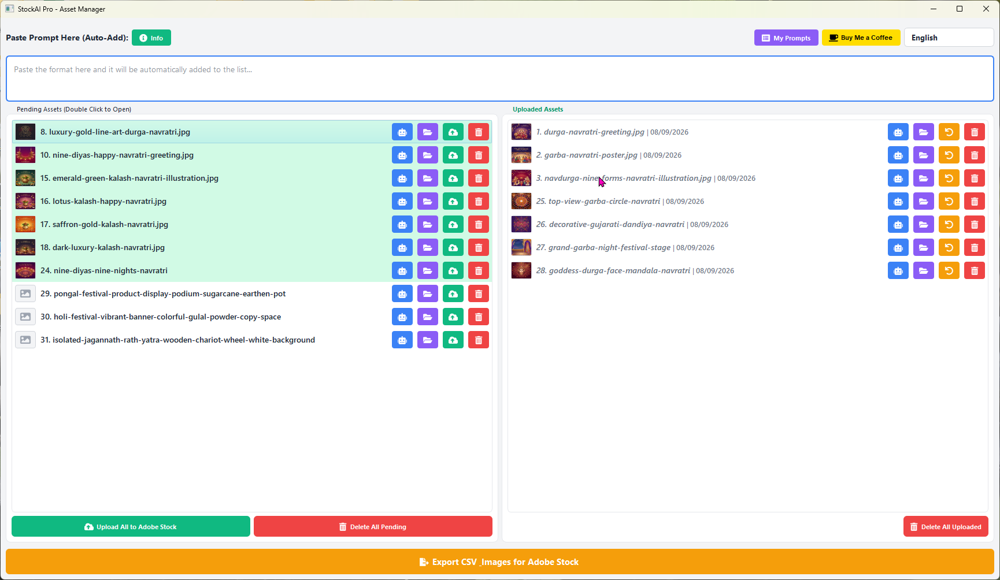
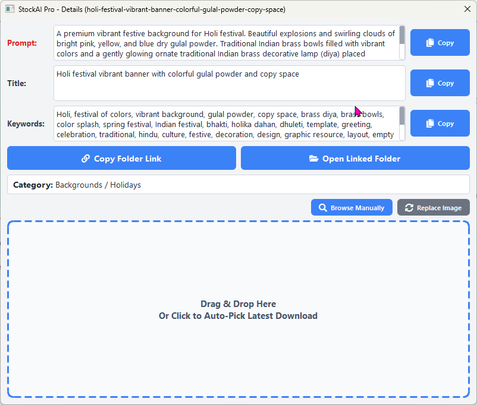
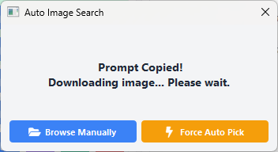
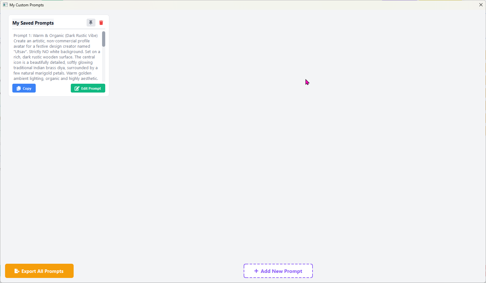
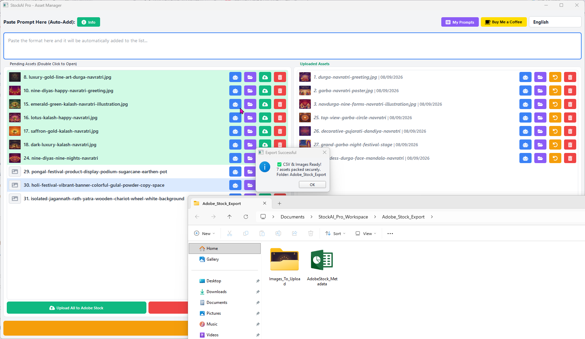

# Stock Ai Pro

Free and source-available Python software for managing AI-generated Adobe Stock assets.

## What it does

Stock Ai Pro is designed around a simple workflow:

**Paste asset format → add to list → copy AI image prompt → generate/download image → automatic image pickup → SEO filename → organize assets → export CSV & images for Adobe Stock**

### Features

- Prompt format auto-add to the pending asset list
- One-click AI prompt copying
- Automatic latest-download image detection
- Manual image browsing and drag & drop
- Automatic SEO-friendly filename assignment
- Asset folders and thumbnails
- Saved prompts and custom prompt manager
- Multiple UI languages
- CSV & image export workflow for Adobe Stock
- Free to use for personal and commercial work

## Requirements

- Windows
- Python 3.x
- PyQt5
- QtAwesome

## Run from source

```bash
python -m venv .venv
.venv\Scripts\activate
pip install -r requirements.txt
python app.py
```

## Project files

```text
Stock-Ai-Pro/
├── app.py
├── requirements.txt
├── README.md
├── LICENSE
└── .gitignore
```

## Screenshots

### Main Interface


### Asset with Generated Image


### Pending Asset


### AI Prompt Workflow


### Custom Prompts


### CSV Bulk Export


## Application data

The application stores its workspace and saved data in the user's Documents folder under:

```text
StockAI_Pro_Workspace/
```

This includes saved prompts, picked-image history, thumbnails, and exported/local asset data.

## Build a Windows executable

For a simple local build:

```bash
pip install pyinstaller
pyinstaller --noconsole --onefile --name "Stock Ai Pro" --icon app_icon.ico app.py
```

If you do not have `app_icon.ico`, remove the `--icon app_icon.ico` part.

The generated executable will be placed in:

```text
dist/
```

You can then package the generated `.exe` with Inno Setup.

## Important

Stock Ai Pro is **not affiliated with Adobe Inc. or Adobe Stock**. Adobe Stock is a trademark of Adobe Inc.

## Support

Stock Ai Pro is free to use.

If you find it useful and would like to support continued development:

☕ https://www.buymeacoffee.com/rishichaurasiya

## License

Stock Ai Pro is free to use, modify, fork, contribute to, and use commercially.

The software itself may not be sold, resold, or redistributed as a paid product without prior written permission from the copyright holder.

See [LICENSE](LICENSE) for the full terms.

## Author

**Rishi Chaurasiya**
